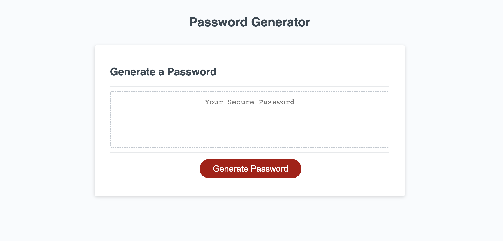

# Password-Generator



[Updated Site](https://senaygebrat.github.io/Password-Generator/)

# About Passsword Generator

The generate button prompts the user to select the criteria for the password, confirming whether or not to include lowercase, uppercase, numberic, and/or special characters with a length of 8-128 characters.

# Code Snippet

Below is a preview of some of the JavaScript code declaring an array that would collect all the inputs of the password selection process.

```function checkGrandArray() {
  var grandArray = [];
  if(yesLowCase){
    grandArray = grandArray.concat(lowerCase);
  }
  if(yesUpCase){
    grandArray = grandArray.concat(upperCase);
  }
  if(yesNum){
    grandArray = grandArray.concat(numeric);
  }
  if(yesSpecialCharacter){
    grandArray = grandArray.concat(specialCharacter);
  }
```

# Author Links

[LinkedIn](https://www.linkedin.com/in/senay-gebrat-566b78250/)
[Github](https://github.com/senaygebrat)
